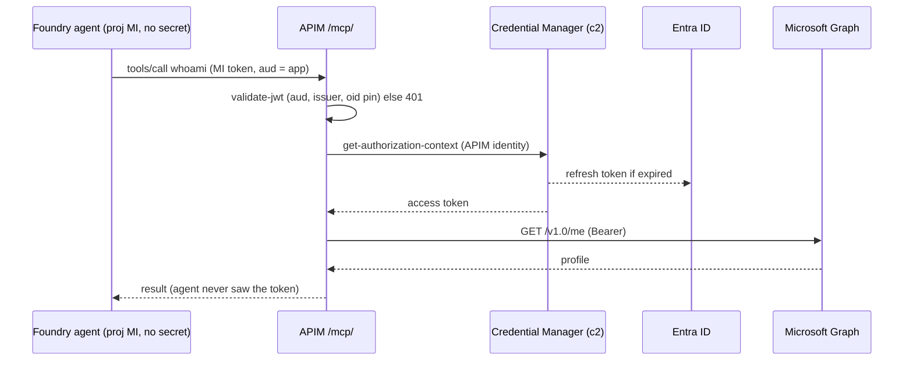

# APIM Credential Manager broker for Foundry agents (Approach A)

A Foundry agent calls Microsoft Graph as a signed-in user **without ever holding that user's token**. Azure API Management (APIM) Credential Manager owns the OAuth token (consent once, then cache and refresh), and a small MCP API in APIM injects it when the agent calls a tool.

## Read this first
**[`EXPLAINER.md`](EXPLAINER.md)** is the textual walkthrough: concepts, the final architecture, every build phase (what we tried, what happened, what it teaches), principles, and what is not proven. Start there, then use the diagram.

## The picture

**Interactive diagram: [`architecture.html`](architecture.html)** — download or clone, then open it in a browser (GitHub doesn't render HTML). It is self-contained and has:
- animated packets for 7 scenarios: Runtime call, One-time consent, and 5 failures (bad caller, other identity, not consented, scope 403, redirect URI);
- Play/Pause, step back/forward, Restart (arrow keys work too);
- cards for the Foundry toolbox layer, Approach B (dimmed, not built), a proof ledger, and a status-code table.

Static version of the runtime path:

One-time consent: a human opens the login link from `getLoginLinks`, accepts in the browser, lands on the redirect page; APIM stores access and refresh tokens.

## What is proven
| Claim | Result |
|---|---|
| Runtime path agent -> APIM -> Graph | PASS |
| Keyless caller auth (project managed identity + oid pin) | PASS |
| Token cache reuse; refresh after expiry | PASS (new token hash, HTTP 200) |
| Revoke connection -> agent fails closed; re-consent -> recovers | PASS (clean 424 in the hardened template) |
| No token / other identity -> 401; scope overreach -> 403; wrong redirect URI rejected | PASS |
| Template: from-scratch deploy to 401 | PASS |
| Template: fresh deploy -> consent -> Connected -> agent answer (`verify.sh`) | PASS (4/4) |
| Per-user isolation / per-user OAuth passthrough (Approach B) | NOT proven, out of scope |

## Contents
- `EXPLAINER.md`: the teaching walkthrough
- `architecture.html`: the animated diagram above
- `index.md`, `R0.md`-`R6.md`: route-by-route results
- Screenshots are not published (they contain real tenant data); command-line proof for every claim is in the R-files
- `template/`: Bicep + scripts; **start with `template/AGENT-RUNBOOK.md`** (coding agent does the CLI work, a human does login, consent and portal checks)
- `template/zoominfo/`: separate, no-deployment ZoomInfo MCP validation checklist, secret-free config example, and offline evidence gate
- `template/zoominfo/test-readiness.html`: interactive visual of shared prerequisites, separate test lanes, and evidence gates
- `template/zoominfo/portal-first-guide.md`: concise portal-by-portal customer walkthrough for the two separate OAuth test lanes
- `template/zoominfo/policy-foundry-passthrough.xml` and `policy-apim-credential-manager.xml`: starting policy drafts with placeholders; not customer-ready or deployable as-is
- `template/zoominfo/customer-replication-runbook.md`: step-by-step customer-owned replication procedure, safety gates, and known IaC/product boundaries
- `knowledge-base.md`: background notes
