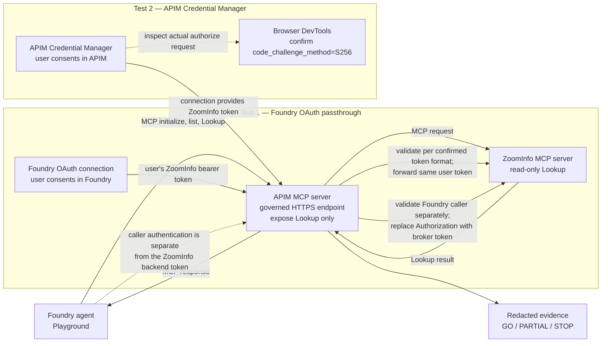

# ZoomInfo MCP test: portal-first guide

Use this guide to run a controlled test in a customer-owned non-production environment. Follow the steps in order. Stop when an input or approval is missing.

## At a glance: what the two tests prove

**How to read it:** Both tests call the same APIM MCP endpoint and the same approved `Lookup` tool. In Test 1, Foundry supplies the user's ZoomInfo token and APIM forwards it. In Test 2, APIM Credential Manager supplies the ZoomInfo token; APIM must separately authenticate the Foundry caller. The PKCE check is made in the browser during the APIM connection login, not in the Foundry Playground and not with the local mock.

The diagram shows the intended test paths. It does not mean either Azure path or the ZoomInfo call has already been run or proven.

This guide describes two separate tests:

1. **Foundry OAuth passthrough** — test this first. Foundry manages each user's delegated OAuth connection.
2. **APIM Credential Manager** — test this second. APIM manages the OAuth connection.

APIM is the governance point in both tests. This guide does not choose between APIM alone and APIM with Toolbox.

## Confirmed ZoomInfo app configuration

The current app is a **Standard** MCP app, not a Partner app. The selected test flow is ZoomInfo's recommended **Authorization Code with PKCE** flow. ZoomInfo also offers **Client Credentials** for server-to-server automation, but that is a separate app authentication mode and does not prove per-user delegated access. This runbook does not switch to Client Credentials.

The screenshots supplied for this discussion show the app-creation choices and client options. They do not show the actual app's callback URL, OAuth endpoint URLs, scopes, MCP server URL, or `Lookup` schema. Get those values and entitlements from the app/service owner before filling in the customer-specific policy or connecting a portal.

> **Status:** This is a portal walkthrough, not a ready-to-run deployment. The repository's Bicep and policy files implement a Microsoft Graph example. They are not ZoomInfo configuration. A customer owner must approve the APIM policy, caller authentication, OAuth settings, test identity, cost, and cleanup before anyone changes a customer resource.

## What a full pass means

| Test | Full pass |
|---|---|
| Foundry OAuth passthrough | A hosted Foundry agent calls the APIM MCP endpoint. The approved test user's delegated identity is verified. The read-only `Lookup` call succeeds with no HTTP, JSON-RPC, or MCP error. |
| APIM Credential Manager | The actual authorization request uses PKCE S256. A request without the required challenge is rejected, if this can be tested safely. The test user's identity is verified. The read-only `Lookup` call succeeds with no HTTP, JSON-RPC, or MCP error. |

A connected OAuth flow or successful token exchange is **partial evidence**, not a full pass. An HTTP 200 alone is not a pass.

## Before you open a portal

Ask the customer owners to provide and approve these inputs:

| Input | Owner | Check |
|---|---|---|
| ZoomInfo Standard OAuth app | ZoomInfo app owner | Client ID, authorization URL, token URL, refresh URL (if required), exact scopes, and confirmation Authorization Code + PKCE is enabled for this app |
| ZoomInfo MCP service | ZoomInfo service owner | HTTPS endpoint, supported MCP transport/version, authentication requirements, and tool list |
| Read-only test | ZoomInfo service owner | Confirm `Lookup` is read-only. Approve a safe test query that contains no sensitive data. |
| Customer test user | Customer test owner | Confirm the user can consent and has ZoomInfo `Lookup` entitlement. |
| Azure route | Azure platform owner | Confirm the non-production APIM instance, Foundry project, network path, and caller-authentication design. |
| Change and evidence controls | Customer security/platform owner | Approve the change window, cost owner, redaction/storage location, and cleanup owner. |

The two tests use **different callback URLs**. Do not reuse one callback for both products.

Do not start if the upstream URL, scopes, read-only behavior, test user's entitlement, caller-authentication design, or approval is unknown. Do not put secrets, tokens, authorization codes, sensitive queries, or full responses in this repository, shell history, or evidence files. Enter secrets only in the customer's approved product connection or secret store.

## Portal preflight: confirm the existing Azure resources

This walkthrough assumes that APIM and Foundry already exist. Use the portals to confirm readiness before changing either resource. No Bicep, deployment script, or Python validator is required for this preflight.

### Check API Management

1. In the Azure portal, open **API Management services** and select the customer-approved non-production instance.
2. On **Overview**, confirm the instance is provisioned and copy its gateway URL. Use the customer-approved HTTPS gateway hostname.
3. Confirm the instance's service tier supports MCP servers. Microsoft currently lists Developer, Basic, Basic v2, Standard, Standard v2, Premium, and Premium v2 for exposing an existing MCP server. Stop if the instance uses an unsupported tier.
4. Open **APIs** > **MCP servers**. Confirm the customer expects this instance to host the test route, or confirm that creating a separate test MCP server is approved.
5. For the Credential Manager lane only, open **APIs** > **Credential manager**. Confirm the feature is available. Later, confirm the system-assigned managed identity and outbound HTTPS access before creating the provider.

**Checkpoint:** The APIM instance is ready, the gateway URL is HTTPS, the tier supports MCP, and the customer owner approves use of this instance.

### Check Foundry

1. Open the Foundry portal and select the customer-approved project.
2. Confirm you can open **Build**, select the intended non-production agent, and open its **Playground**.
3. Confirm the project owner approves adding a temporary MCP tool connection to this agent.

**Checkpoint:** The correct project and agent are open, and the test owner approves the change.

### Check the route prerequisites

1. Ask the ZoomInfo service owner to confirm that the MCP server has a publicly or privately reachable HTTPS endpoint from the approved Azure services, supports Streamable HTTP, and meets APIM's documented MCP version requirements.
2. Ask the network owner to confirm APIM can reach the ZoomInfo endpoint over HTTPS and Foundry can reach the APIM gateway. The portal's resource overview does not prove these network paths; the connection and live test provide that evidence.
3. Confirm the customer has approved a non-sensitive Lookup query and the named test user has the required entitlement.

**Checkpoint:** Owners confirm endpoint reachability and entitlement. If reachability is unknown, do not treat a successful resource preflight as proof; resolve the network path before proceeding.

## Portal 1: prepare the ZoomInfo OAuth app

Use the customer's ZoomInfo developer or app-management portal. The portal labels can vary by account.

1. Open the approved **Standard** OAuth app. Do not select or create a Partner app for this test.
2. Record the client ID and the documented authorization, token, and refresh URLs.
3. Record the exact scopes approved for the test user. Do not add scopes to make the test work.
4. Confirm this app is configured for **Authorization Code with PKCE**, as selected for the current test. Do not switch to **Client Credentials**; that mode is for automated server-to-server authentication and is not the per-user delegated test.
5. Leave the redirect/callback settings open. Add each product's callback only after that product displays its exact URL.

**Checkpoint:** The ZoomInfo owner confirms this Standard app's URLs, scopes, Authorization Code + PKCE setup, test-user access, and read-only `Lookup` behavior.

## Portal 2: expose the ZoomInfo MCP service through APIM

Do this once before testing either lane. Use an approved non-production APIM instance in a tier that supports MCP servers.

1. In the Azure portal, open the API Management instance.
2. Select **APIs** > **MCP servers** > **+ Create MCP server**.
3. Select **Expose an existing MCP server**.
4. Enter the customer-approved ZoomInfo MCP base URL. Keep **Streamable HTTP** selected if that is the service's documented transport.
5. Give the APIM MCP server a clear test name and base path. Add a description that identifies the non-production test.
6. Select **Create**. Open the new MCP server and copy its APIM **Server URL**.
7. Open the MCP server's **Tools** blade. Expose only the approved `Lookup` tool. Keep the MCP protocol methods needed for session setup and tool discovery available; they are protocol methods, not ZoomInfo tools.

**Checkpoint:** APIM lists the MCP server and exposes only the approved tools.

### Configure the APIM policy before connecting Foundry

In the APIM MCP server, open **MCP** > **Policies**. The customer platform owner must review and approve the policy before it is saved.

The policy must:

- authenticate and authorize the incoming Foundry caller;
- route only to the approved ZoomInfo MCP host and path;
- support the selected lane's backend-token handling;
- preserve MCP streaming and JSON-RPC messages;
- expose only the approved `Lookup` tool in the MCP server's **Tools** blade;
- avoid logging authorization headers, tokens, codes, or full Lookup payloads.

The current repository policy is for Microsoft Graph. **Do not paste it here.** This repository now contains two starting policy templates: [`policy-foundry-passthrough.xml`](policy-foundry-passthrough.xml) and [`policy-apim-credential-manager.xml`](policy-apim-credential-manager.xml). They are not customer-ready policies. They use placeholders and state their assumptions at the top. A customer owner must confirm the token format, issuer, audience, claims, endpoint, and selected lane, then review the filled-in policy before it is saved or used. If those details are unknown, keep the route unpublished and do not accept test traffic.

**Checkpoint:** The final policy has no unresolved placeholders. The customer owners have reviewed the ZoomInfo backend URL, inbound caller identity, outbound token source, exposed tool list, and evidence redaction. Do not save or use a draft template as-is.

Microsoft's portal walkthrough: [Expose and govern an existing MCP server](https://learn.microsoft.com/azure/api-management/expose-existing-mcp-server). It describes the create flow and policy location. For authentication boundaries, see [Secure access to MCP servers in API Management](https://learn.microsoft.com/azure/api-management/secure-mcp-servers).

## Test 1: Foundry OAuth passthrough

This is the first test. It checks whether each Foundry user can call `Lookup` through APIM with that user's delegated identity.

### Add the MCP tool in Foundry

1. Open the customer Foundry project in the Foundry portal.
2. Select **Build**, then open the approved non-production agent.
3. In **Playground**, open **Tools** and select **Add**.
4. Select **Custom** > **Model Context Protocol (MCP)** > **Create**.
5. Enter a unique tool name and the **APIM Server URL** from the previous section. Do not enter the ZoomInfo backend URL here.
6. Set **Authentication** to **OAuth Identity Passthrough**.
7. Enter the ZoomInfo app's client ID, authorization URL, token URL, and exact approved scopes. Enter a client secret if the app requires one. For the refresh URL, follow the provider's instructions; use the token URL only if the provider specifies that they are the same endpoint.
8. Select **Connect**. Copy the redirect URL that Foundry displays.
9. Return to the ZoomInfo app portal. Add the Foundry redirect URL to the app's allowed callback/redirect URLs. Save the app.
10. Return to Foundry. Finish saving the MCP tool. Enable human approval for tool calls if the project offers that setting.

**Checkpoint:** Foundry lists the MCP tool. The ZoomInfo app lists the exact Foundry callback URL.

Microsoft's procedure: [Connect to Model Context Protocol servers](https://learn.microsoft.com/azure/foundry/agents/how-to/tools/model-context-protocol) and [MCP authentication](https://learn.microsoft.com/azure/foundry/agents/how-to/mcp-authentication).

### Run one read-only test

1. Sign in as the approved test user.
2. Start the agent and complete the OAuth consent flow. Approve only the scopes in the customer's record.
3. Confirm that the MCP tool list contains `Lookup` and no unapproved write tool.
4. Ask the agent to call `Lookup` with the approved safe test query. Review the tool name and arguments before approval.
5. Ask the platform owner to verify, using approved redacted diagnostics, that APIM forwarded the test user's delegated identity to ZoomInfo.
6. Record the timestamp, connection name, HTTP status, presence or absence of JSON-RPC and MCP errors, read-only verification, and redacted evidence reference.

**GO:** the actual hosted call succeeds and the backend identity is verified as the signed-in test user.

**PARTIAL:** consent or token exchange succeeds, but the Lookup call or identity proof is missing.

**STOP:** the wrong identity reaches the backend, an unapproved scope or tool is requested, or the result cannot be confirmed as read-only.

## Test 2: APIM Credential Manager

Run this as a separate test. Use a separate provider and connection. Do not treat this lane as per-user until the customer proves how the incoming user maps to the correct Credential Manager connection.

### Create the provider and connection in APIM

1. In the Azure portal, open the approved APIM instance.
2. Confirm that its system-assigned managed identity is enabled and that the instance has the required outbound HTTPS access.
3. Select **APIs** > **Credential manager** > **+ Create**.
4. Select the documented **Generic OAuth 2.0 with PKCE** option. Do not select ordinary authorization code as a substitute.
5. Enter the ZoomInfo authorization and token URLs, client ID, client secret, and exact approved scopes. Use only fields shown by the APIM portal.
6. Review the APIM redirect URL shown during provider setup. Copy it.
7. Return to the ZoomInfo app portal. Add the APIM redirect URL as an allowed callback/redirect URL. Save the app.
8. Return to APIM and confirm the displayed redirect URL matches the registered URL exactly.
9. Create a connection. Select **Login**, sign in as the approved test user, and approve only the approved scopes.
10. Complete the connection setup. Confirm APIM shows the connection as **Connected**.

**Checkpoint:** The provider uses the portal's PKCE option, the callback URLs match, and the connection is connected.

Microsoft's procedures: [Configure common credential providers](https://learn.microsoft.com/azure/api-management/credentials-configure-common-providers#generic-oauth-providers), [Configure a connection](https://learn.microsoft.com/azure/api-management/configure-credential-connection), and [Credential Manager process flow](https://learn.microsoft.com/azure/api-management/credentials-process-flow).

### Prove PKCE and run Lookup

#### Inspect APIM's actual authorization request

Use the **browser used for the Azure portal login** (Microsoft Edge or Google Chrome). Do not use the local mock or an application script for this check. The repo has no script that observes APIM Credential Manager's live OAuth request.

1. Before selecting **Login** for the APIM connection, open browser Developer Tools (`F12`) and select **Network**. Turn on **Preserve log**.
2. Select **Login** in APIM Credential Manager and follow the redirect to the ZoomInfo authorization page.
3. In the Network list, select the request to the ZoomInfo **authorization endpoint**. Inspect its query parameters. If the request opened in a new tab, inspect that tab's address bar or open Developer Tools in that tab.
4. Confirm `code_challenge` is present and `code_challenge_method` is exactly `S256`.
5. Record only `code_challenge_present=true` and `code_challenge_method=S256`. Do not copy the challenge value, `state`, authorization code, access token, or refresh token. Do not export a HAR file or save a full URL or screenshot containing OAuth values.
6. Continue login and consent only after confirming the app, redirect URL, and scopes are correct. A successful authorization-code exchange is useful evidence, but it does not replace the S256 observation.

If you cannot inspect the request safely, ask the APIM or identity owner to capture only the two redacted facts above. If neither option is available, record **PARTIAL/BLOCKED**. Do not infer PKCE from the portal's "with PKCE" label alone.

#### Optional no-PKCE negative check

This is a separate test of the **ZoomInfo authorization server**, not a script test of APIM. Do it only if the ZoomInfo app owner approves a no-challenge request against the non-production app.

1. Use a separate browser session and the documented ZoomInfo authorization endpoint, registered APIM callback URL, client ID, approved test scope, and a fresh random `state`.
2. Build an authorization request with `response_type=code`, but omit both `code_challenge` and `code_challenge_method`. Do not include a client secret.
3. Open the request in the browser. If the provider displays an explicit PKCE-required error before sign-in, record `no_challenge_rejected=true`.
4. If it proceeds to sign-in or consent, do not sign in, consent, or obtain a code. Close the tab and record `no_challenge_rejected=false` (or `not_tested` if the result is unclear). This is not a pass.
5. Never exchange a code from this negative check. Do not store the full URL or browser network log.

Do not use a generic online OAuth tester, third-party proxy, or an unreviewed script. If the app owner does not approve this probe, set the negative-check result to `not_tested`; a customer-approved positive S256 observation and successful code exchange are still required.

#### Save the policy and call Lookup

1. Have the platform owner adapt [`policy-apim-credential-manager.xml`](policy-apim-credential-manager.xml), replace and review all placeholders, and save the approved policy under the APIM MCP server's **MCP** > **Policies** blade. It uses one fixed connection under APIM's managed identity. It does not select a connection per user. Do not claim per-user access unless the customer establishes and tests that identity-to-connection mapping.
2. In the Foundry portal, open the same non-production agent used for Test 1. In **Build** > agent > **Playground** > **Tools**, confirm the configured MCP tool points to the APIM Server URL. Its inbound caller authentication must match the policy's caller-token validation. That caller token is separate from the ZoomInfo token fetched by Credential Manager.
3. Confirm APIM's **Tools** blade exposes only `Lookup`. Do not use the sample Graph policy.
4. Sign in as the approved test user. Run a prompt that calls `Lookup` with the approved safe query. Review the tool name and arguments; approve only that call.
5. Confirm the call succeeds in the Foundry Playground. Have the platform owner confirm from APIM and approved ZoomInfo diagnostics that APIM fetched the intended Credential Manager connection and ZoomInfo returned the Lookup result. Do not enable body logging to troubleshoot MCP streaming.
6. Record the Foundry run timestamp, MCP tool/connection name, HTTP status, JSON-RPC error status, MCP `isError`, read-only verification, connection identity model, redacted evidence reference, PKCE observation, and no-challenge result.

**GO:** S256 is proven, the test user's identity-to-connection mapping is proven, and the hosted Lookup succeeds with no protocol error.

**PARTIAL:** the connection or token exchange succeeds, but S256 or Lookup is not proven. If a shared APIM connection was used, report the result as a shared-connection test; it does not pass a per-user delegation test.

**STOP:** the portal does not offer the PKCE option, S256 is absent, caller/connection mapping is unclear, or the policy permits unapproved tools.

Microsoft documents both an APIM portal PKCE option and a generic OAuth provider. The repository's checked ARM/Bicep contract does not identify a documented IaC setting that selects mandatory PKCE S256. Use the portal for this experiment. Do not invent an IaC field. See the [PKCE capability note](README.md#pkce-capability-blocker).

The repository's [`zoominfo_validation.py`](zoominfo_validation.py) script can evaluate a redacted evidence file after the customer runs the test. It is **offline only**: it does not inspect browser traffic, make an OAuth request, call Foundry/APIM/ZoomInfo, or verify that entered evidence is true. See [Record the result and clean up](#record-the-result-and-clean-up) for its command.

## Record the result and clean up

1. Save only redacted observations in the customer's approved evidence location. Do not save secrets, codes, tokens, sensitive arguments, or full responses.
2. Use `template/zoominfo/evidence.example.json` as the evidence field reference. The offline validator checks the recorded fields; it does not verify that the evidence is true.
3. Record one outcome for each lane: **GO**, **PARTIAL**, or **STOP**. Keep the lanes separate.
4. Revoke test-user consent and remove the temporary Foundry tool/agent, APIM connection, policies, and test resources under the customer's approved cleanup process.
5. Confirm that no test credential or public endpoint remains. Record cleanup in the customer's system of record.

For the full input checklist, evidence fields, stop conditions, and cleanup controls, continue to the [detailed customer replication runbook](customer-replication-runbook.md).

## What this test does not prove

The local mock and simulations use fictional data and synthetic tokens. They test local protocol behavior only. They do not prove ZoomInfo OAuth, scopes, entitlements, token claims, Azure APIM policy behavior, Credential Manager PKCE, or Foundry's hosted per-user flow.

This test also does not settle the broader APIM-only versus APIM-plus-Toolbox architecture. Keep APIM as the governance layer in either option.
