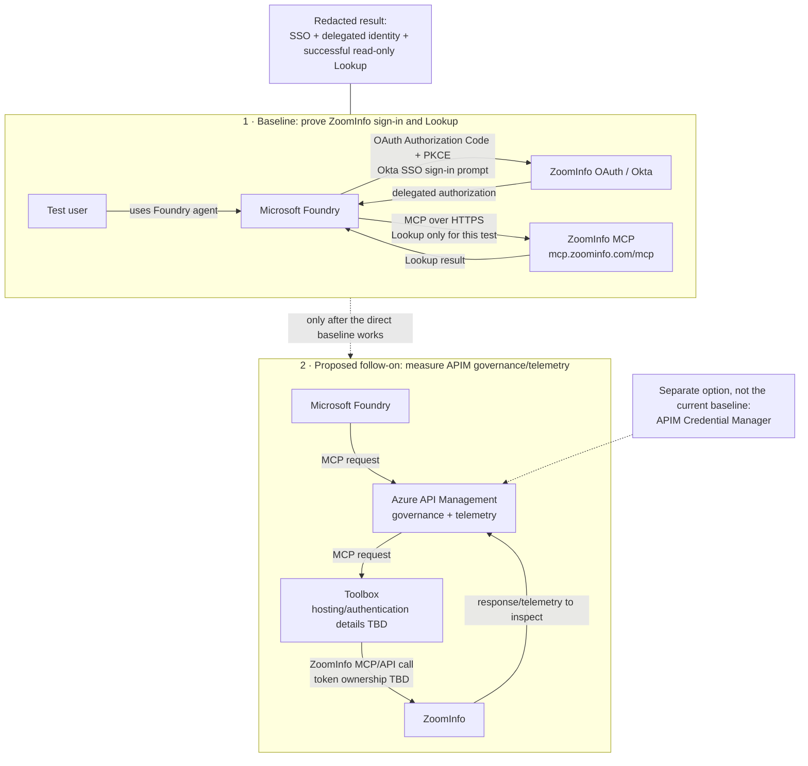

# ZoomInfo MCP test: portal-first guide

Use this guide to run a controlled test in a customer-owned non-production environment. Follow the steps in order. Stop when an input or approval is missing.

## At a glance: baseline test and proposed next step

**How to read it:** The first test is direct: Foundry connects to ZoomInfo's MCP endpoint and starts the user's Authorization Code + PKCE sign-in. The provided setup shows OAuth URLs under `okta-login.zoominfo.com`; ZoomInfo's public PKCE guide shows an authorize endpoint under `api.zoominfo.com`. Ask ZoomInfo to confirm the observed URLs are correct for this app. The user expects the Okta SSO prompt; verify it in the actual sign-in rather than inferring it from the hostname. APIM is not on this call path and provides no telemetry for this baseline. The later Toolbox → APIM route is a proposal; its token ownership and exact topology are not yet confirmed.

The diagram shows the test plan, not a result. The customer must verify the actual provider prompt, token identity, and live tool response.

The current sequence is:

1. **Baseline:** Foundry connects directly to ZoomInfo using the Standard app's Authorization Code + PKCE settings.
2. **Proposed follow-on:** after the baseline works, create a Toolbox and expose it through APIM. Measure the APIM telemetry available on that route.
3. **Separate option:** APIM Credential Manager remains an independent experiment. It is not required for the direct baseline or implied by the Toolbox proposal.

Do not treat these as the same route. Do not claim APIM governance or telemetry for the direct baseline.

## Confirmed ZoomInfo app configuration

The current app is a **Standard** MCP app, not a Partner app. The selected test flow is ZoomInfo's recommended **Authorization Code with PKCE** flow. ZoomInfo also offers **Client Credentials** for server-to-server automation, but that is a separate app authentication mode and does not prove per-user delegated access. This runbook does not switch to Client Credentials.

The supplied connection screenshot shows the MCP endpoint `https://mcp.zoominfo.com/mcp`, OAuth Identity Passthrough, and the scopes `zi_api zi_mcp api:data:mcp offline_access`. It also shows ZoomInfo-hosted OAuth endpoints under `okta-login.zoominfo.com`. Treat these as observed settings in the screenshot, not proof that the values are correct for every environment or that the scopes are least-privilege. The screenshot does not show the full authorization/token URLs, actual registered redirect URI, `Lookup` schema, exact scope grants, or test user's entitlement. Ask the ZoomInfo app/service owner to confirm them. Never copy the screenshot's client ID or secret into repository files.

> **Status:** This is a portal walkthrough, not a ready-to-run deployment. The direct baseline needs no APIM policy. The repository's Bicep and policy files implement a Microsoft Graph example; they are not ZoomInfo configuration. Customer owners must approve the OAuth settings, test identity, scopes, cost, and cleanup before testing.

## What scopes are requested, and what are we testing?

The supplied Foundry connection screen shows these requested OAuth scopes: `zi_api`, `zi_mcp`, `api:data:mcp`, and `offline_access`. ZoomInfo's documentation says API scopes determine which capabilities an app can access and recommends granting only the permissions it needs. Its public scope catalog does not list the first three exact values shown in the screenshot, and it does not define `offline_access` as an API permission. ZoomInfo's separate PKCE/refresh-token documentation says the code flow returns a refresh token; ask ZoomInfo whether Foundry needs `offline_access` and what the three ZoomInfo-specific values grant. Do not infer that `api:data:mcp` is Lookup-only or that this scope set is least-privilege.

There are two different kinds of scope in this test:

| Scope | What it means here |
|---|---|
| OAuth permission scope | The permissions the ZoomInfo app requests and the user consents to. In the supplied screenshot these are `zi_api zi_mcp api:data:mcp offline_access`. ZoomInfo defines the granted API permissions; confirm their exact effects with ZoomInfo. |
| Test/tool scope | The behavior we intend to exercise: one approved, read-only `Lookup` call with a safe test query. This is a narrow test plan, not proof that the OAuth token itself is restricted to Lookup. |

If the ZoomInfo scopes permit a broader tool/data surface, keep the test user, tool selection, and query restricted. If strict Lookup-only authorization is required, ask ZoomInfo whether the app can be configured with narrower scopes or tool entitlements.

## What the public documentation supports

| Documentation | What it supports | What it does not prove |
|---|---|---|
| [ZoomInfo Standard App](https://docs.gtm.ai/docs/standard-app) | Standard apps support Authorization Code + PKCE for signed-in users and Client Credentials for server-to-server automation. | That this specific app's endpoint, scopes, redirect, or entitlement is correct. |
| [ZoomInfo Authorization Code Flow (PKCE)](https://docs.gtm.ai/docs/authorization-code-flow-pkce) | ZoomInfo documents PKCE S256 as required for its authorization-code flow and shows its public authorize endpoint. | That Foundry or this customer's Okta-hosted URLs have completed the flow successfully. The screenshot's `okta-login.zoominfo.com` URLs differ from the public guide's shown hostname; ask ZoomInfo to confirm the supported app-specific URLs. |
| [ZoomInfo OAuth scopes](https://docs.gtm.ai/docs/zoominfo-oauth-scopes) | ZoomInfo publishes API permission scopes and advises least privilege. | The exact meaning of `zi_api`, `zi_mcp`, and `api:data:mcp` shown in the connection screenshot; the public catalog does not list those names. |
| [ZoomInfo refresh-token flow](https://docs.gtm.ai/docs/refresh-tokens-flow) | ZoomInfo documents that Authorization Code + PKCE returns access and refresh tokens, and that refresh tokens rotate. | Whether Foundry requires the requested `offline_access` value for this app and how it handles refresh-token rotation. |
| [Foundry MCP authentication](https://learn.microsoft.com/azure/foundry/agents/how-to/mcp-authentication) | Microsoft documents OAuth Identity Passthrough for MCP tools, including custom OAuth configuration and redirect handling. | That ZoomInfo's particular MCP endpoint, Okta SSO, and app configuration work with Foundry. |
| [Expose an existing MCP server through APIM](https://learn.microsoft.com/azure/api-management/expose-existing-mcp-server) and [monitor MCP traffic](https://learn.microsoft.com/azure/api-management/monitor-mcp-servers) | Microsoft documents the generic external-MCP gateway pattern and APIM telemetry for MCP requests, including tool, client, duration, and success fields. | That the proposed Toolbox topology or token propagation has been implemented and validated in this customer's environment. |

These sources give the customer a credible, first-party reference for each platform feature. They do not document a complete ZoomInfo + Okta + Foundry + Toolbox + APIM deployment as one tested recipe. This guide supplies that project-specific sequence and records which parts remain to be proven. If ZoomInfo or Microsoft provides an exact supported recipe, use it as the source of truth and update this guide to match.

## What a full pass means

| Test | Full pass |
|---|---|
| Direct Foundry baseline | Foundry shows the expected ZoomInfo/Okta sign-in. The approved test user's delegated identity is verified at ZoomInfo. The read-only `Lookup` call succeeds with no HTTP, JSON-RPC, or MCP error. APIM is not part of this pass. |
| Proposed Toolbox through APIM | The deployed topology and token owner are documented. The approved read-only `Lookup` succeeds through Toolbox and APIM. The customer verifies caller identity and observes APIM telemetry. Microsoft documents default tool/client/duration/success fields; arguments and results are excluded by default. |
| Optional APIM Credential Manager experiment | PKCE S256 and the intended connection identity are proven. The read-only `Lookup` succeeds through the separately configured APIM route. |

A connected OAuth flow or successful token exchange is **partial evidence**, not a full pass. An HTTP 200 alone is not a pass.

## Before you open a portal

Ask the customer owners to provide and approve these inputs:

| Input | Owner | Check |
|---|---|---|
| ZoomInfo Standard OAuth app | ZoomInfo app owner | Client ID, full authorization/token/refresh URLs, exact grants for `zi_api`, `zi_mcp`, `api:data:mcp`, `offline_access` (if retained), and confirmation Authorization Code + PKCE is enabled for this app |
| ZoomInfo MCP service | ZoomInfo service owner | Confirm the observed endpoint `https://mcp.zoominfo.com/mcp`, supported MCP transport/version, authentication requirements, and tool list |
| Read-only test | ZoomInfo service owner | Confirm `Lookup` is read-only. Approve a safe test query that contains no sensitive data. |
| Customer test user | Customer test owner | Confirm the user can consent and has ZoomInfo `Lookup` entitlement. |
| Azure route | Azure platform owner | Confirm the Foundry project for baseline; APIM instance and network path only for the proposed Toolbox/APIM follow-on. |
| Change and evidence controls | Customer security/platform owner | Approve the change window, cost owner, redaction/storage location, and cleanup owner. |

The direct Foundry baseline uses the redirect URI generated by the Foundry connection. The optional APIM Credential Manager experiment uses its own APIM callback. Do not reuse or guess callbacks.

Do not start if the upstream URL, scopes, read-only behavior, test user's entitlement, or approval is unknown. Do not put secrets, tokens, authorization codes, sensitive queries, or full responses in this repository, shell history, or evidence files. Enter secrets only in the customer's approved product connection or secret store.

## Portal preflight: confirm Foundry and the direct endpoint

The baseline needs an existing Foundry project and a ZoomInfo MCP endpoint reachable from Foundry. It does not need an APIM route, Bicep, deployment script, or Python validator. Check APIM only when the customer approves the later Toolbox/APIM experiment.

### Check Foundry

1. Open the Foundry portal and select the customer-approved project.
2. Confirm you can open **Build**, select the intended non-production agent, and open its **Playground**.
3. Confirm the project owner approves adding a temporary MCP tool connection to this agent.

**Checkpoint:** The correct project and agent are open, and the test owner approves the change.

### Check the direct ZoomInfo endpoint

1. Confirm the endpoint is exactly the customer-approved ZoomInfo MCP URL. The supplied screenshot shows `https://mcp.zoominfo.com/mcp`; the service owner must confirm it is valid for this app and test environment.
2. Ask the ZoomInfo service owner to confirm the transport, MCP version, published tools, and that Foundry can reach the HTTPS endpoint.
3. Confirm the customer has approved a non-sensitive `Lookup` query and the named test user has the required entitlement.

**Checkpoint:** Owners confirm endpoint reachability and entitlement. The Foundry connection attempt is the runtime reachability check.

## Portal 1: prepare the ZoomInfo OAuth app

Use the customer's ZoomInfo developer or app-management portal. The portal labels can vary by account.

1. Open the approved **Standard** OAuth app. Do not select or create a Partner app for this test.
2. Record the client ID and the documented authorization, token, and refresh URLs. ZoomInfo's public PKCE guide shows `https://api.zoominfo.com/gtm/oauth/v1/authorize`; the supplied screenshot shows OAuth URLs under `okta-login.zoominfo.com`. Ask ZoomInfo to confirm the correct app-specific URLs before connecting.
3. Record the exact scopes approved for the test user. The screenshot lists `zi_api zi_mcp api:data:mcp offline_access`. Ask ZoomInfo to define the three ZoomInfo-specific scopes and confirm which are required for MCP Lookup. Do not add scopes to make the test work.
4. Confirm this app is configured for **Authorization Code with PKCE**, as selected for the current test. Do not switch to **Client Credentials**; that mode is for automated server-to-server authentication and is not the per-user delegated test.
5. Leave the redirect/callback settings open. Add Foundry's exact redirect URI after Foundry displays it. Add an APIM callback only if the separate Credential Manager experiment is approved.

**Checkpoint:** The ZoomInfo owner confirms this Standard app's URLs, scopes, Authorization Code + PKCE setup, test-user access, and read-only `Lookup` behavior.

## Portal 2: connect Foundry directly to ZoomInfo

This is the first live integration test. Do not create an APIM MCP route or apply either repository policy for this baseline.

1. Open the customer Foundry project in the Foundry portal.
2. Select **Build**, then open the approved non-production agent.
3. In **Playground**, open **Tools** and select **Add**.
4. Select **Custom** > **Model Context Protocol (MCP)** > **Create**.
5. Enter a unique tool name and the ZoomInfo endpoint confirmed by the service owner. The supplied connection screen shows `https://mcp.zoominfo.com/mcp`.
6. Set **Authentication** to **OAuth Identity Passthrough**.
7. Enter the ZoomInfo Standard app's client ID, client secret, authorization URL, token URL, and exact approved scopes. The screenshot shows `zi_api zi_mcp api:data:mcp offline_access`; use that set only if ZoomInfo confirms it is correct and least-privilege for this test. Enter the refresh URL if the connection form requires it.
8. Select **Connect**. Copy the redirect URL that Foundry displays.
9. Return to the ZoomInfo app portal. Add the Foundry redirect URL to the app's allowed callback/redirect URLs. Save the app.
10. Return to Foundry. Finish saving the MCP tool. Enable human approval for tool calls if the project offers that setting.

**Checkpoint:** Foundry lists the direct ZoomInfo MCP tool. The ZoomInfo Standard app lists the exact Foundry callback URL.

Microsoft's procedure: [Connect to Model Context Protocol servers](https://learn.microsoft.com/azure/foundry/agents/how-to/tools/model-context-protocol) and [MCP authentication](https://learn.microsoft.com/azure/foundry/agents/how-to/mcp-authentication).

### Run one read-only test

1. Sign in as the approved test user.
2. Start the agent and complete the OAuth consent flow. Approve only the scopes in the customer's record.
3. Confirm that the MCP tool list contains `Lookup` and no unapproved write tool.
4. Ask the agent to call `Lookup` with the approved safe test query. Review the tool name and arguments before approval.
5. Verify through ZoomInfo's approved user/audit diagnostics that the request used the intended test user's delegated identity. Foundry sign-in success alone does not prove which identity ZoomInfo received.
6. Record the timestamp, Foundry tool/connection name, HTTP status, presence or absence of JSON-RPC and MCP errors, read-only verification, the scopes consented to, and a redacted evidence reference. Do not record the client secret or token.

**GO:** Foundry shows the expected ZoomInfo/Okta sign-in, the hosted direct call succeeds, and ZoomInfo-side evidence confirms the signed-in test user.

**PARTIAL:** consent or token exchange succeeds, but the Lookup call or ZoomInfo-side identity proof is missing.

**STOP:** the wrong identity reaches the backend, an unapproved scope or tool is requested, or the result cannot be confirmed as read-only.

## Proposed follow-on: expose Toolbox through APIM

Run this only after the direct Foundry baseline is recorded and the platform owners define the Toolbox role, hosting, and token ownership. The current proposal is Foundry → APIM → Toolbox → ZoomInfo. Do not assume Toolbox replaces the direct ZoomInfo OAuth connection or that APIM receives a user token.

1. Ask the team proposing Toolbox to document where it runs, which MCP endpoint it exposes, how it authenticates to ZoomInfo, and how the user's identity/token moves through it.
2. In the Azure portal, open the approved APIM instance. Confirm the tier supports MCP and copy the HTTPS gateway URL.
3. Select **APIs** > **MCP servers** > **+ Create MCP server** > **Expose an existing MCP server**.
4. Enter the Toolbox HTTPS MCP endpoint, select its documented transport, give the APIM MCP server a test name/base path, and create it.
5. In the APIM MCP server's **Tools** blade, expose only the test-approved `Lookup` capability and required MCP protocol methods.
6. Before connecting Foundry, have the platform/security owner review the inbound caller authentication, backend authentication, routing, allowlist, streaming, and logging policy. Do not paste the Graph example policy or either draft policy without adapting and reviewing it.
7. Connect the Foundry test agent to the APIM gateway URL. Use the authentication mode the architecture owner has selected and document it. Do not assume OAuth passthrough to ZoomInfo if Toolbox terminates or exchanges credentials.
8. Run the same approved read-only `Lookup` query. Record tool success, identity at ZoomInfo, and APIM telemetry available for the request. Microsoft's documented default telemetry includes tool, client, duration, and success; arguments and results are not included by default. Do not log tokens or sensitive request/response bodies.
9. Compare the telemetry with the direct baseline: can the operator correlate a request, identify the caller, see tool/method/status and latency, and distinguish upstream errors without exposing OAuth material? Treat payload logging as a separate, explicitly approved data-exposure decision.

**Checkpoint:** The real topology is documented; one approved Lookup works end to end; and the team has a redacted telemetry sample showing what APIM can and cannot observe.

## Optional separate experiment: APIM Credential Manager

This is not the direct Foundry baseline or the proposed Toolbox route. Run it only if the team explicitly wants to test APIM as the owner of the ZoomInfo OAuth connection. It needs a separate provider/connection, APIM callback, reviewed APIM policy, and its own identity test.

If selected, use the APIM portal's documented **Generic OAuth 2.0 with PKCE** option. Inspect the actual APIM authorization request in browser Developer Tools and confirm `code_challenge_method=S256`; a connected status alone does not prove PKCE. The repository's [`policy-apim-credential-manager.xml`](policy-apim-credential-manager.xml) is a fixed-connection draft and does not establish per-user connection selection.

Microsoft references: [Configure common credential providers](https://learn.microsoft.com/azure/api-management/credentials-configure-common-providers#generic-oauth-providers), [Configure a connection](https://learn.microsoft.com/azure/api-management/configure-credential-connection), and [Credential Manager process flow](https://learn.microsoft.com/azure/api-management/credentials-process-flow).

### Optional no-PKCE negative check

This tests the ZoomInfo authorization server, not APIM. Only do it if the ZoomInfo app owner approves a no-challenge request against the non-production app.

1. Use a separate browser session and the documented ZoomInfo authorization endpoint, registered APIM callback URL, client ID, approved test scope, and a fresh random `state`.
2. Build an authorization request with `response_type=code`, but omit both `code_challenge` and `code_challenge_method`. Do not include a client secret.
3. Open the request in the browser. If the provider displays an explicit PKCE-required error before sign-in, record `no_challenge_rejected=true`.
4. If it proceeds to sign-in or consent, do not sign in, consent, or obtain a code. Close the tab and record `no_challenge_rejected=false` (or `not_tested` if the result is unclear). This is not a pass.
5. Never exchange a code from this negative check. Do not store the full URL or browser network log.

Do not use a generic online OAuth tester, third-party proxy, or an unreviewed script. If the app owner does not approve this probe, set the negative-check result to `not_tested`; a customer-approved positive S256 observation and successful code exchange are still required.

## Record the result and clean up

1. Save only redacted observations in the customer's approved evidence location. Do not save secrets, codes, tokens, sensitive arguments, or full responses.
2. Use `template/zoominfo/evidence.example.json` as the evidence field reference. The offline validator checks the recorded fields; it does not verify that the evidence is true.
3. Record one outcome for each lane: **GO**, **PARTIAL**, or **STOP**. Keep the lanes separate.
4. Revoke test-user consent and remove the temporary Foundry tool/agent, APIM connection, policies, and test resources under the customer's approved cleanup process.
5. Confirm that no test credential or public endpoint remains. Record cleanup in the customer's system of record.

For the full input checklist, evidence fields, stop conditions, and cleanup controls, continue to the [detailed customer replication runbook](customer-replication-runbook.md).

## What this test does not prove

The local mock and simulations use fictional data and synthetic tokens. They test local protocol behavior only. They do not prove ZoomInfo OAuth, scopes, entitlements, token claims, Azure APIM policy behavior, Credential Manager PKCE, or Foundry's hosted per-user flow.

The current direct baseline does not exercise APIM or provide APIM telemetry. The later Toolbox-through-APIM experiment is a proposal whose token flow and telemetry must be observed, not assumed. This work does not select between APIM alone and APIM plus Toolbox.
